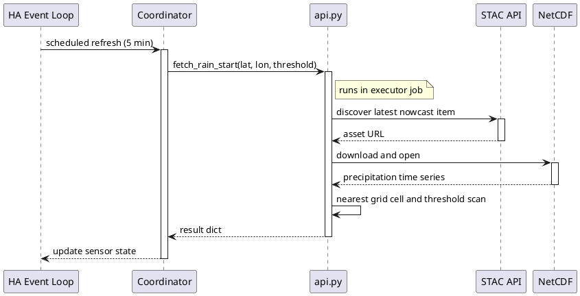
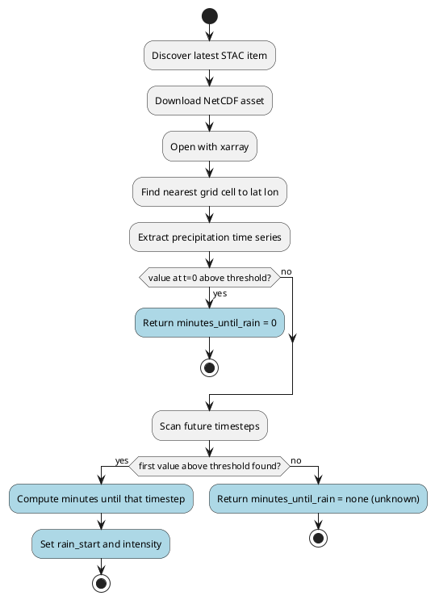
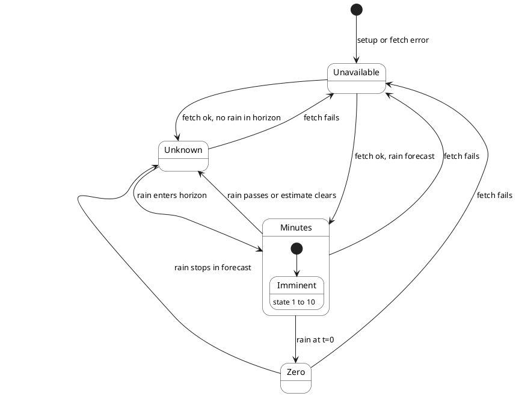
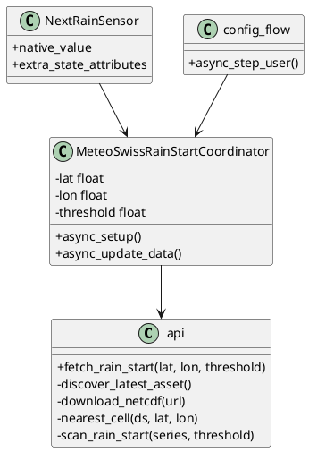
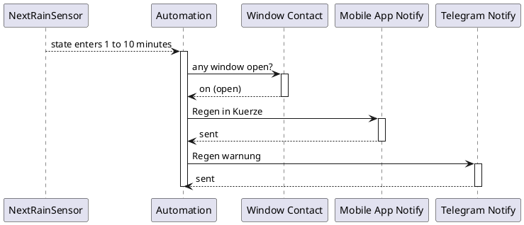

# MeteoSwiss Rain-Start Implementation Plan

**Status:** Implemented (v0.1.2)  
**Date:** 2026-06-20

## Overview

Home Assistant custom integration that estimates when rain will start at a configured location in Switzerland, using MeteoSwiss nowcasting (INCA-CH) open data via the FSDI STAC API. Primary use case: notify when rain is expected within 10 minutes and windows are open.

Domain: `meteoswiss_rainstart` (do not reuse `meteoswiss` — Rudd-O's forecast integration already occupies that domain).

## Release v0.1.2 (2026-06-20)

Shipped integration with dual data-source strategy:

| Source | STAC collection | Format | Status in production |
|--------|-----------------|--------|----------------------|
| **Primary** | `ch.meteoschweiz.ogd-nowcasting` | `RR-INCA` NetCDF, 10 min grid | STAC items exist; **assets not published yet** |
| **Fallback** | `ch.meteoschweiz.ogd-local-forecasting` | `rre150h0` CSV, hourly point | **Active** — nearest postal-code point (e.g. Belp) |

Entity: `sensor.meteoswiss_rainstart_next_rain_minutes`

### Module map (as built)

```
custom_components/meteoswiss_rainstart/
├── __init__.py          async_setup_entry
├── manifest.json        v0.1.2, h5netcdf deps
├── const.py
├── api.py               nowcasting STAC + NetCDF + rain scan
├── local_forecast.py    point-forecast CSV fallback
├── coordinator.py       DataUpdateCoordinator
├── sensor.py            NextRainSensor
├── config_flow.py       UI setup (en/de)
├── diagnostics.py
└── translations/en.json, de.json

tests/
├── conftest.py          stub HA package for unit tests
├── test_api.py
├── test_local_forecast.py
└── fixtures/RR_INCA_202106280700.nc

scripts/deploy.sh
hacs.json                scaffold only
requirements-dev.txt     venv deps (+ pytest)
```

### Dev workflow

```bash
python3 -m venv .venv
.venv/bin/pip install -r requirements-dev.txt
.venv/bin/pytest tests/ -m 'not integration'
./scripts/deploy.sh
# restart Home Assistant
```

## Architecture

```plantuml
@startuml
skinparam componentStyle rectangle

legend top right
  <#GhostWhite,#GhostWhite>|        |= **Legend** |
  |<#00b050>   | not changed |
  |<#0070c0>   | new |
  |<#ff9933>   | modified |
  |<#ff0000>   | removed |
  |<#a6a6a6>   | unknown |
  |<#grey>   | not of relevance |
endlegend

package "Home Assistant" {
  [Config Flow] <<new>> #LightBlue as cf
  [MeteoSwissRainStartCoordinator] <<new>> #LightBlue as coord
  [NextRainSensor] <<new>> #LightBlue as sensor
  [Window Rain Automation] <<new>> #LightBlue as auto
}

package "Integration Modules" <<new>> #LightBlue {
  [api.py] <<new>> #LightBlue as api
  [coordinator.py] <<new>> #LightBlue as coordmod
  [sensor.py] <<new>> #LightBlue as sensormod
}

cloud "MeteoSwiss FSDI" {
  [STAC API] as stac
  [NetCDF Assets] as nc
}

cf --> coord
coord --> coordmod
coordmod --> api
sensormod --> coord
sensor --> sensormod
api --> stac
api --> nc
sensor --> auto

@enduml
```

## Design Decisions

| Decision | Rationale |
|----------|-----------|
| `DataUpdateCoordinator` | HA standard for periodic cloud polling and shared error handling |
| Domain `meteoswiss_rainstart` | Avoids conflict with existing `custom_components/meteoswiss` |
| STAC + NetCDF, not app scraping | Official MeteoSwiss open-data access path |
| Sensor-only v0.1 | Minutes-until-rain is enough for automations; weather entity later |
| Nearest 1 km grid cell | Matches published resolution; simple v1 lookup |
| Blocking work in executor | STAC download and xarray parsing must not block the event loop |
| `_async_setup` on coordinator | One-time validation (CH grid bounds, config) before first poll |
| `api.py` separation | Blocking STAC/NetCDF logic isolated from HA async coordinator |
| `local_forecast.py` fallback | Nowcasting grid assets not yet on STAC; local point CSV keeps integration usable |
| `h5netcdf` not `netcdf4` | HA Core container cannot install `netcdf4` (missing libnetcdf) |
| Chained providers in `fetch_rain_start()` | Try nowcasting first; fall back without user config change |
| rsync deploy, no symlink | Dev machine cannot symlink into Docker-mounted HA config |
| Copy-paste to HA config | Git repo is single source of truth; HA receives deployed copies only |

## Detailed Design

### Data sources

**Primary (nowcasting grid — target state)**

- Collection: `ch.meteoschweiz.ogd-nowcasting`
- Asset marker: `RR-INCA` / `RR_INCA` NetCDF
- 1 km grid, ~10 min timesteps, horizon up to ~6 h
- Implementation ready; **STAC asset lists empty as of v0.1.2**

**Fallback (local point forecast — current production)**

- Collection: `ch.meteoschweiz.ogd-local-forecasting`
- Parameter: `rre150h0` (hourly precipitation total, mm)
- Bundle file: `vnut12.lssw.{ref}.rre150h0.csv` (all points in one CSV)
- Point lookup: `ogd-local-forecasting_meta_point.csv` → nearest postal code (type 2), then station (type 1)
- Same forecast family as MeteoSwiss app; **hourly** resolution limits 1–10 minute automation precision until grid nowcast is published

### Poll cycle



### Rain-start computation



### Sensor state machine



### Module structure



### Coordinator data model

```python
{
    "minutes_until_rain": int | None,   # None = no rain in horizon
    "rain_start": datetime | None,      # timezone-aware Europe/Zurich
    "intensity": float | None,          # mm/h or mm per hour (fallback)
    "source_updated": datetime,         # MeteoSwiss publish / model ref time
    "forecast_horizon_minutes": int,
    "data_source": str,                 # "nowcasting" | "local_forecasting"
    "forecast_point": str | None,       # e.g. "Belp" (local fallback only)
}
```

### Sensor entity

| Property | Value |
|----------|-------|
| Entity | `sensor.meteoswiss_rainstart_next_rain_minutes` |
| State | minutes until rain (`int`), or `unknown` when no rain in horizon |
| Unit | `min` |
| Attributes | `rain_start`, `intensity`, `source_updated`, `forecast_horizon_minutes`, `threshold_mm`, `latitude`, `longitude`, `data_source`, `forecast_point` |

### Diagnostics

Integration diagnostics: Settings → Devices & services → MeteoSwiss Rain-Start → Diagnostics

| Key | Content |
|-----|---------|
| `stac_collection` | Primary nowcasting collection ID |
| `data_source` | Active provider: `nowcasting` or `local_forecasting` |
| `forecast_point` | Resolved point name when using local fallback |
| `last_fetch_status` | `ok`, `stac_error`, `download_error`, `parse_error`, `out_of_bounds` |
| `last_fetch_at` | Timestamp of last coordinator update attempt |
| `configured_threshold_mm` | Active precipitation threshold |
| `configured_location` | Lat/lon from config entry |
| `last_result` | Latest rain-start computation snapshot |

Diagnostics are read-only debug output — not exposed as sensor attributes.

### Repository layout

```
ha-meteoswiss-rainstart/
├── docs/
│   ├── how/2026-06-20-1400-meteoswiss-rainstart-plan.md
│   ├── changelog.md
│   └── README.md
├── scripts/deploy.sh
├── custom_components/meteoswiss_rainstart/
│   ├── __init__.py
│   ├── manifest.json
│   ├── const.py
│   ├── config_flow.py
│   ├── coordinator.py
│   ├── sensor.py
│   ├── api.py
│   ├── local_forecast.py
│   ├── diagnostics.py
│   └── translations/en.json, de.json
├── tests/
│   ├── conftest.py
│   ├── test_api.py
│   ├── test_local_forecast.py
│   └── fixtures/RR_INCA_202106280700.nc
├── requirements-dev.txt
└── hacs.json
```

### Python dependencies (`manifest.json`)

| Package | Purpose |
|---------|---------|
| `pystac-client` | STAC catalog discovery |
| `xarray` | NetCDF reading |
| `numpy` | Threshold scanning |
| `h5netcdf` | NetCDF backend in HA containers (`netcdf4` not used — install fails) |
| `httpx` | Asset download |
| `pyproj` | WGS84 → LV95 for grid lookup |

Dev venv additionally installs `netcdf4`, `pytest` via `requirements-dev.txt`.

### Config flow defaults

| Field | Default |
|-------|---------|
| Latitude | `hass.config.latitude` (46.8986) |
| Longitude | `hass.config.longitude` (7.49578) |
| Threshold | 0.1 mm/h (tune after inspecting real data) |
| Poll interval | 300 s |

### Automation



Trigger: `numeric_state` on sensor, `above: 0`, `below: 11`.  
Condition: `binary_sensor.any_window_open` (group contacts `binary_sensor.0xc4d8c8fffeafa6bb_contact`, `binary_sensor.0x08b95ffffe4a2807_contact` — `on` = open).  
Actions: `notify.mobile_app_iphone_16_pro_von_carsten`, `notify.telegram`.  
Spam control: start with `mode: single`; add `input_boolean` helper if duplicates occur.

Replace or disable existing automation `Notify when rain is about to start` (id `1778493348393`) — **still required manually**; legacy template references `precipitation_probability` which the weather entity no longer exposes.

Suggested replacement (add to `automations.yaml`, disable id `1778493348393`):

```yaml
- id: meteoswiss_rainstart_window_notify
  alias: Notify when rain is about to start (nowcast)
  triggers:
  - trigger: numeric_state
    entity_id: sensor.meteoswiss_rainstart_next_rain_minutes
    above: 0
    below: 11
  conditions:
  - condition: state
    entity_id: binary_sensor.any_window_open
    state: "on"
  actions:
  - action: notify.mobile_app_iphone_16_pro_von_carsten
    data:
      message: Regen in Kuerze
  - action: notify.telegram
    data:
      message: Regen warnung
  mode: single
```

Note: with `data_source: local_forecasting`, values are hourly — treat 1–10 minute triggers as best-effort until grid nowcast is live.

## Implementation Steps

| Phase | Steps | Status |
|-------|-------|--------|
| **0 Bootstrap** | Module stubs, `manifest.json`, `scripts/deploy.sh` | Done |
| **1 Data spike** | STAC discovery, NetCDF parse, `fetch_rain_start()` | Done (nowcasting assets pending on STAC) |
| **2 HA wiring** | Coordinator, sensor, diagnostics, `async_setup_entry` | Done |
| **3 Config flow** | UI setup, en/de translations | Done |
| **4 Automation** | Window group, rain-warning automation | Partial — group in `configuration.yaml`; automation YAML manual |
| **5 Release** | Tests, `hacs.json` scaffold, docs v0.1.2 | Done (git tag optional) |
| **5b Fallback** | `local_forecast.py` for unpublished grid assets | Done in v0.1.2 |

### Deploy workflow

```bash
# scripts/deploy.sh <ha-custom-components-target>
rsync -av --delete \
  custom_components/meteoswiss_rainstart/ \
  /config/custom_components/meteoswiss_rainstart/
```

After deploy: restart HA (required for `manifest.json` changes), add integration via UI, check States and logs.

Dev loop: edit → commit → `./scripts/deploy.sh <target>` → restart → verify.

Do not commit deployed copies into the HA config git repo; add `custom_components/meteoswiss_rainstart` to HA `.gitignore` for single source of truth.

## Files Changed

| File | Action |
|------|--------|
| `custom_components/meteoswiss_rainstart/manifest.json` | New |
| `custom_components/meteoswiss_rainstart/__init__.py` | New |
| `custom_components/meteoswiss_rainstart/const.py` | New |
| `custom_components/meteoswiss_rainstart/api.py` | New |
| `custom_components/meteoswiss_rainstart/coordinator.py` | New |
| `custom_components/meteoswiss_rainstart/sensor.py` | New |
| `custom_components/meteoswiss_rainstart/diagnostics.py` | New (Phase 2) |
| `custom_components/meteoswiss_rainstart/config_flow.py` | New |
| `custom_components/meteoswiss_rainstart/translations/*.json` | New |
| `scripts/deploy.sh` | New |
| `custom_components/meteoswiss_rainstart/local_forecast.py` | New (v0.1.2) |
| `tests/test_local_forecast.py` | New (v0.1.2) |
| `tests/conftest.py`, `requirements-dev.txt` | New (v0.1.2) |
| Home Assistant `automations.yaml` | Modified (Phase 4) |
| Home Assistant `configuration.yaml` | Modified (window group, Phase 4) |

## Testing Strategy

| Layer | Method |
|-------|--------|
| `api.py` | Standalone script at home coordinates; compare with MeteoSwiss app during rain events |
| Unit tests | Small NetCDF fixture in `tests/fixtures/`; assert threshold scan for dry and rainy series |
| Integration | Deploy to HA; watch sensor over 2–3 update cycles in Developer Tools |
| Diagnostics | Download diagnostics JSON; confirm STAC collection and fetch status after a poll |
| Automation | Manually set test threshold or wait for rain; confirm notify only when window open |
| Failure | Disconnect network; confirm sensor goes `unavailable`, recovers on reconnect |

## Error Handling

| Situation | Sensor state | Notes |
|-----------|--------------|-------|
| No rain in forecast horizon | `unknown` | Not an error |
| STAC, download, or parse failure | `unavailable` | Coordinator raises `UpdateFailed` |
| Currently raining | `0` | Automation still fires if windows open |
| Location outside CH grid | `unavailable` | Log warning at setup |

## Risks and Mitigations

| Risk | Mitigation |
|------|------------|
| Wrong STAC collection or variable name | Phase 1 spike; document findings in `api.py` |
| Heavy deps slow HA restart | Accept one-time install cost; keep deps minimal (no scipy) |
| Estimate stale for 5–10 min | Match poll interval to MeteoSwiss update cadence |
| Duplicate notifications | `mode: single` plus optional boolean helper |
| Deploy drift from git source | Always deploy via `scripts/deploy.sh`; never edit HA copy directly |
| Name clash with `meteoswiss` | Use `meteoswiss_rainstart` everywhere |

## Known Limitations (v0.1.2)

- Switzerland only (CH grid / published point catalog)
- One location per config entry
- Nearest-cell / nearest-point lookup only (no interpolation)
- **Nowcasting grid not yet on STAC** — fallback hourly local forecast in use
- Hourly fallback limits precision of 1–10 minute automations
- `netcdf4` not supported in HA manifest; dev venv may use it as optional engine fallback
- Copy-paste deploy required (no symlink); `hacs.json` scaffolded but not published to HACS
- Legacy rain automation must be disabled manually

## Future Extensions

- Weather entity with precipitation timeline
- Multiple locations
- HACS distribution
- Binary sensor `rain_imminent` for simpler automations
- Persistent dismissible notification

## Minimal Deliverable (v0.1.2)

- [x] Config flow (en/de), one location
- [x] Sensor `sensor.meteoswiss_rainstart_next_rain_minutes` with rain-start attributes + `data_source`, `forecast_point`
- [x] `unavailable` / `unknown` / minutes states
- [x] Integration diagnostics
- [x] `scripts/deploy.sh`
- [x] Unit tests + NetCDF fixture
- [x] Local forecast fallback when grid assets missing
- [ ] Window-rain automation deployed in HA (manual)
- [ ] Git tag `v0.1.2` (optional)

## Agent Handoff

v0.1.2 is deployed and functional via local forecast fallback. Next steps:

1. Disable automation `1778493348393` and add `meteoswiss_rainstart_window_notify` (see Automation section).
2. Monitor STAC collection `ch.meteoschweiz.ogd-nowcasting` for `RR-INCA` assets — integration will switch to `data_source: nowcasting` automatically.
3. After grid data is live, re-evaluate 1–10 minute automation thresholds.
4. Optional: git tag `v0.1.2`, publish HACS, add weather entity / binary sensor.

## Related Documents

- [meteoswiss_rainstart_concept.md](../what/meteoswiss_rainstart_concept.md) — original concept (this repo)
- [Documentation README](../README.md) — folder conventions
- [Changelog](../changelog.md) — document history

## Changelog

| Date | Change |
|------|--------|
| 2026-08-30 | Removed private repo URL, host paths, and Gitea-specific deploy notes |
| 2026-06-20 | **v0.1.2:** documented local forecast fallback, h5netcdf, implementation status, automation handoff |
| 2026-06-20 | Aligned concept and plan: diagnostics, `_async_setup`, `api.py`, sensor naming, HACS scope, cross-references |
| 2026-06-20 | Restructured per documentation skill; added PlantUML diagrams, metadata sections |
| 2026-06-20 | Initial plan from concept; copy-paste deploy workflow |

## Prompt History

- User requested a plan for a MeteoSwiss rain-start custom component aligned with an existing concept document
- User created a git repo and local clone; symlink not possible, deploy via copy-paste
- User asked to apply the documentation skill to the plan
