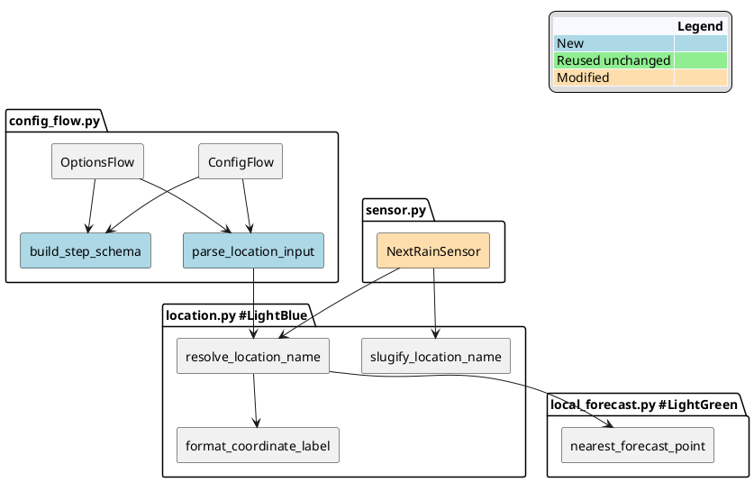
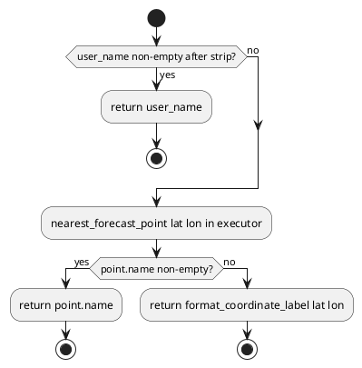
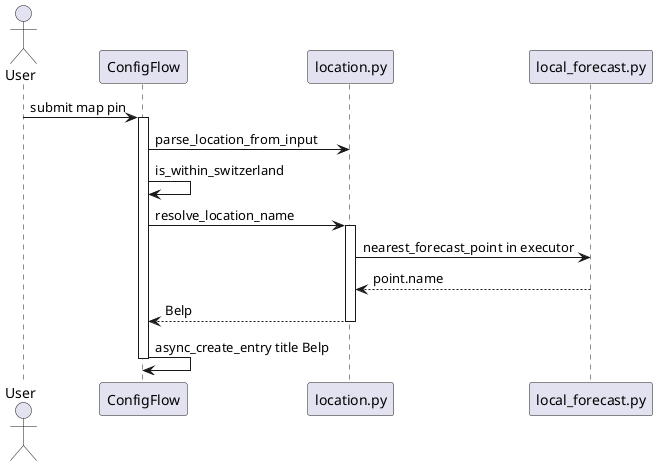

# Entity Location Naming & Map Picker — Implementation Plan

**Status:** Draft plan  
**Date:** 2026-06-20  
**Target version:** **0.1.4**  
**Audience:** Cheap / low-context coding agent — follow steps in order, do not skip tests.

## Overview

Implement v0.1.4 of `meteoswiss_rainstart`: integrated map picker in config flow, persisted `location_name`, and location-aware device/entity naming (*Next rain in Belp*). Spec: [concept](../what/2026-06-20-1417-entity-location-naming.md).

**Principles:**

| Principle | How applied |
|-----------|---------------|
| **TDD** | Write failing test → minimal code → green → refactor. Run pytest after every step. |
| **DRY** | One schema builder, one location flattener, one slugify, one resolver — shared by user + options flow. |
| **SOLID** | `location.py` = naming only (SRP). Config flow calls resolver (DIP). No STAC/NetCDF in config flow. |

## Architecture



## Agent rules (read first)

1. **Repo root:** this repository
2. **Run tests:** `.venv/bin/pytest tests/ -m 'not integration' -q` after each step.
3. **Do not** add new pip dependencies — use existing `httpx`, `local_forecast.nearest_forecast_point`.
4. **Do not** change coordinator poll logic or `api.py` rain scan.
5. **Do not** remove `latitude`/`longitude` from entry data — coordinator depends on flat keys.
6. **Do not** change entity_id for existing v1 entries on migration — preserve `sensor.meteoswiss_rainstart_next_rain_minutes`.
7. **Do not** hardcode `entity.entity_id` in `async_setup_entry` for new entries — use slug from `location_name`.
8. **Stop and fix** if pytest fails before starting the next step.

## Module map

| Module | Responsibility (SRP) | New? |
|--------|----------------------|------|
| `const.py` | Keys only | extend |
| `location.py` | Name resolution, slugify, parse map dict | **new** |
| `config_flow.py` | UI flows only — delegates to `location.py` | modify |
| `sensor.py` | Entity surface — reads entry, sets names | modify |
| `coordinator.py` | Unchanged except diagnostics if needed | minimal |
| `diagnostics.py` | Pass-through | minimal |
| `local_forecast.py` | Reuse `nearest_forecast_point` — **no edits** | — |

## Location name resolution (cheap default)

Skip external Nominatim geocoding in v0.1.4 — MeteoSwiss forecast point names are sufficient and offline-friendly after catalog cache.



Priority: **user name → forecast point → `"46.89, 7.50"`**.

---

## Phase 0 — Baseline

**Action:** Confirm tests pass before changes.

```bash
.venv/bin/pytest tests/ -m 'not integration' -q
```

**Expected:** All green. If venv missing: `python3 -m venv .venv && .venv/bin/pip install -r requirements-dev.txt`

---

## Phase 1 — Constants (TDD)

### Step 1.1 — Test first

Create `tests/test_location.py`:

```python
"""Tests for location naming helpers."""

from meteoswiss_rainstart.location import (
    format_coordinate_label,
    slugify_location_name,
)
from meteoswiss_rainstart.const import CONF_LOCATION, CONF_LOCATION_NAME


def test_slugify_simple():
    assert slugify_location_name("Belp") == "belp"


def test_slugify_umlaut():
    assert slugify_location_name("Büren") == "bueren"


def test_slugify_spaces_and_punctuation():
    assert slugify_location_name("Garden Shed!") == "garden_shed"


def test_format_coordinate_label():
    assert format_coordinate_label(46.8912, 7.5023) == "46.89, 7.50"


def test_conf_keys_exist():
    assert CONF_LOCATION == "location"
    assert CONF_LOCATION_NAME == "location_name"
```

Run — **must fail** (module missing).

### Step 1.2 — Implement

**File:** `custom_components/meteoswiss_rainstart/const.py` — append:

```python
CONF_LOCATION = "location"
CONF_LOCATION_NAME = "location_name"
```

**File:** `custom_components/meteoswiss_rainstart/location.py` — create:

```python
"""Location naming helpers for config and entity registry."""

from __future__ import annotations

import re
import unicodedata

from homeassistant.const import CONF_LATITUDE, CONF_LONGITUDE

from .const import CONF_LOCATION

_SLUG_RE = re.compile(r"[^a-z0-9]+")


def slugify_location_name(name: str) -> str:
    """Normalize a display name to a safe entity_id slug."""
    normalized = unicodedata.normalize("NFKD", name)
    ascii_name = normalized.encode("ascii", "ignore").decode("ascii")
    slug = _SLUG_RE.sub("_", ascii_name.lower()).strip("_")
    return slug or "location"


def format_coordinate_label(latitude: float, longitude: float) -> str:
    """Human-readable coordinate fallback."""
    return f"{latitude:.2f}, {longitude:.2f}"


def parse_location_from_input(location: dict[str, float]) -> tuple[float, float]:
    """Extract lat/lon from LocationSelector dict (DRY for config flows)."""
    return float(location[CONF_LATITUDE]), float(location[CONF_LONGITUDE])
```

Run pytest — Phase 1 green.

---

## Phase 2 — Resolver (TDD)

### Step 2.1 — Tests first

Append to `tests/test_location.py`:

```python
from unittest.mock import patch

import pytest

from meteoswiss_rainstart.local_forecast import ForecastPoint
from meteoswiss_rainstart.location import resolve_location_name_sync


def test_resolve_prefers_user_name():
    result = resolve_location_name_sync(46.89, 7.50, user_name="Garden")
    assert result == "Garden"


def test_resolve_strips_user_name():
    result = resolve_location_name_sync(46.89, 7.50, user_name="  Belp  ")
    assert result == "Belp"


@patch("meteoswiss_rainstart.location.nearest_forecast_point")
def test_resolve_uses_forecast_point(mock_nearest):
    mock_nearest.return_value = ForecastPoint(
        point_id="1", point_type_id="2", name="Belp",
        latitude=46.89, longitude=7.50,
    )
    result = resolve_location_name_sync(46.89, 7.50, user_name=None)
    assert result == "Belp"


@patch("meteoswiss_rainstart.location.nearest_forecast_point", side_effect=Exception("fail"))
def test_resolve_falls_back_to_coordinates(mock_nearest):
    result = resolve_location_name_sync(46.89, 7.50, user_name=None)
    assert result == "46.89, 7.50"
```

Run — must fail.

### Step 2.2 — Implement

Append to `location.py`:

```python
from .local_forecast import nearest_forecast_point


def resolve_location_name_sync(
    latitude: float,
    longitude: float,
    *,
    user_name: str | None = None,
) -> str:
    """Resolve display name: user > forecast point > coordinates."""
    if user_name and (stripped := user_name.strip()):
        return stripped
    try:
        point = nearest_forecast_point(latitude, longitude)
        if point.name.strip():
            return point.name.strip()
    except Exception:
        pass
    return format_coordinate_label(latitude, longitude)


async def resolve_location_name(
    hass,
    latitude: float,
    longitude: float,
    user_name: str | None = None,
) -> str:
    """Async wrapper — forecast catalog I/O in executor."""
    return await hass.async_add_executor_job(
        resolve_location_name_sync,
        latitude,
        longitude,
        user_name=user_name,
    )
```

Run pytest — Phase 2 green.

---

## Phase 3 — Config flow schema helper (DRY)

### Step 3.1 — Tests first

Create `tests/test_config_flow.py`:

```python
"""Config flow helper tests (no HA instance)."""

from meteoswiss_rainstart.config_flow import build_setup_schema
from meteoswiss_rainstart.const import CONF_LOCATION, CONF_THRESHOLD


def test_build_setup_schema_has_location_selector():
    schema = build_setup_schema()
    assert CONF_LOCATION in schema.schema
    assert CONF_THRESHOLD in schema.schema
```

Run — must fail.

### Step 3.2 — Implement schema builder

**File:** `config_flow.py` — add imports and shared builder at module level (before class):

```python
from homeassistant.helpers import selector

from .const import CONF_LOCATION, CONF_LOCATION_NAME, CONF_THRESHOLD, CONF_POLL_INTERVAL, ...
from .location import parse_location_from_input, resolve_location_name


def build_setup_schema() -> vol.Schema:
    """Shared schema for user and options steps (DRY)."""
    return vol.Schema(
        {
            vol.Required(CONF_LOCATION): selector.LocationSelector(
                selector.LocationSelectorConfig(
                    radius=False,
                    icon="mdi:weather-pouring",
                )
            ),
            vol.Optional(CONF_LOCATION_NAME): str,
            vol.Optional(CONF_THRESHOLD, default=DEFAULT_THRESHOLD_MM): vol.Coerce(float),
            vol.Optional(CONF_POLL_INTERVAL, default=DEFAULT_POLL_INTERVAL): vol.All(
                vol.Coerce(int), vol.Range(min=60, max=3600)
            ),
        }
    )
```

Export `build_setup_schema` — test passes.

---

## Phase 4 — Config flow user step

### Step 4.1 — Rewrite `async_step_user`

Replace `STEP_USER_SCHEMA` usage with `build_setup_schema()`.

**`_default_schema`:**

```python
@callback
def _default_schema(self) -> vol.Schema:
    return self.add_suggested_values_to_schema(
        build_setup_schema(),
        {
            CONF_LOCATION: {
                CONF_LATITUDE: self.hass.config.latitude,
                CONF_LONGITUDE: self.hass.config.longitude,
            },
            CONF_THRESHOLD: DEFAULT_THRESHOLD_MM,
            CONF_POLL_INTERVAL: DEFAULT_POLL_INTERVAL,
        },
    )
```

**`async_step_user` submit logic:**

```python
location = user_input[CONF_LOCATION]
latitude, longitude = parse_location_from_input(location)

await self.async_set_unique_id(f"{latitude:.4f}_{longitude:.4f}")
self._abort_if_unique_id_configured()

if not is_within_switzerland(latitude, longitude):
    errors["base"] = "outside_switzerland"
    # re-show form with user_input preserved

location_name = await resolve_location_name(
    self.hass, latitude, longitude, user_input.get(CONF_LOCATION_NAME)
)

return self.async_create_entry(
    title=location_name,
    data={
        CONF_LATITUDE: latitude,
        CONF_LONGITUDE: longitude,
        CONF_LOCATION_NAME: location_name,
        CONF_THRESHOLD: user_input[CONF_THRESHOLD],
        CONF_POLL_INTERVAL: user_input[CONF_POLL_INTERVAL],
    },
)
```

Remove old top-level `STEP_USER_SCHEMA` with separate lat/lon fields.

### Step 4.2 — Bump config entry version

In `MeteoSwissRainStartConfigFlow`:

```python
VERSION = 2

async def async_migrate_entry(hass, entry):
    if entry.version == 1:
        if CONF_LOCATION_NAME not in entry.data:
            lat = entry.data[CONF_LATITUDE]
            lon = entry.data[CONF_LONGITUDE]
            name = await resolve_location_name(hass, lat, lon, None)
            data = {**entry.data, CONF_LOCATION_NAME: name}
            hass.config_entries.async_update_entry(
                entry, data=data, title=name, version=2
            )
    return True
```

Register migration on the class per HA docs (`@classmethod async def async_migrate_entry`).

**Migration rule:** Do **not** rename entity_id for v1 entries.

Run pytest — existing tests still green.

---

## Phase 5 — Options flow

### Step 5.1 — Add `async_get_options_flow`

At bottom of `config_flow.py`:

```python
class MeteoSwissRainStartOptionsFlow(config_entries.OptionsFlow):
    """Handle options."""

    def __init__(self, config_entry: config_entries.ConfigEntry) -> None:
        self.config_entry = config_entry

    async def async_step_init(self, user_input=None):
        errors = {}
        entry = self.config_entry

        if user_input is None:
            return self.async_show_form(
                step_id="init",
                data_schema=self._options_schema(entry),
            )

        latitude, longitude = parse_location_from_input(user_input[CONF_LOCATION])

        if not is_within_switzerland(latitude, longitude):
            errors["base"] = "outside_switzerland"
        else:
            user_label = user_input.get(CONF_LOCATION_NAME)
            keep_name = user_label.strip() if user_label else entry.data.get(CONF_LOCATION_NAME)
            if not user_label or not user_label.strip():
                keep_name = await resolve_location_name(
                    self.hass, latitude, longitude, None
                )
            else:
                keep_name = user_label.strip()

            data = {
                **entry.data,
                CONF_LATITUDE: latitude,
                CONF_LONGITUDE: longitude,
                CONF_LOCATION_NAME: keep_name,
                CONF_THRESHOLD: user_input[CONF_THRESHOLD],
                CONF_POLL_INTERVAL: user_input[CONF_POLL_INTERVAL],
            }
            self.hass.config_entries.async_update_entry(entry, data=data, title=keep_name)
            return self.async_create_entry(title="", data={})

        return self.async_show_form(
            step_id="init",
            data_schema=self.add_suggested_values_to_schema(
                build_setup_schema(), user_input
            ),
            errors=errors,
        )

    @callback
    def _options_schema(self, entry):
        return self.add_suggested_values_to_schema(
            build_setup_schema(),
            {
                CONF_LOCATION: {
                    CONF_LATITUDE: entry.data[CONF_LATITUDE],
                    CONF_LONGITUDE: entry.data[CONF_LONGITUDE],
                },
                CONF_LOCATION_NAME: entry.data.get(CONF_LOCATION_NAME, ""),
                CONF_THRESHOLD: entry.data.get(CONF_THRESHOLD, DEFAULT_THRESHOLD_MM),
                CONF_POLL_INTERVAL: entry.data.get(
                    CONF_POLL_INTERVAL, DEFAULT_POLL_INTERVAL
                ),
            },
        )


@callback
def async_get_options_flow(config_entry):
    return MeteoSwissRainStartOptionsFlow(config_entry)
```

Wire in `config_flow.py` — HA discovers `async_get_options_flow` automatically when exported.

**Note:** Empty `options` entry + update `config_entry.data` triggers reload via existing `async_reload_entry` listener.

---

## Phase 6 — Sensor naming (TDD)

### Step 6.1 — Test slug → entity_id

Append `tests/test_location.py`:

```python
def test_entity_id_slug_from_name():
    from meteoswiss_rainstart.location import entity_id_for_location

    assert entity_id_for_location("Belp") == "sensor.meteoswiss_rainstart_belp_next_rain_minutes"
```

Implement in `location.py`:

```python
from .const import DOMAIN, SENSOR_KEY

def entity_id_for_location(location_name: str) -> str:
    slug = slugify_location_name(location_name)
    return f"sensor.{DOMAIN}_{slug}_{SENSOR_KEY}"
```

### Step 6.2 — Modify `sensor.py`

```python
from .const import CONF_LOCATION_NAME, SENSOR_KEY
from .location import entity_id_for_location

class NextRainSensor(...):
    _attr_has_entity_name = True
    _attr_translation_key = SENSOR_KEY
    # REMOVE static _attr_name

    def __init__(self, coordinator, entry):
        super().__init__(coordinator)
        self._entry = entry
        self._location_name = entry.data.get(CONF_LOCATION_NAME, "MeteoSwiss Rain-Start")
        self._attr_unique_id = f"{entry.entry_id}_{SENSOR_KEY}"
        self._attr_device_info = {
            "identifiers": {(DOMAIN, entry.entry_id)},
            "name": self._location_name,
            "manufacturer": "MeteoSwiss",
        }
        self._attr_translation_placeholders = {"location_name": self._location_name}

    @property
    def extra_state_attributes(self):
        attrs = { ... existing ... }
        attrs["location_name"] = self._location_name
        return attrs
```

**`async_setup_entry` in sensor.py:**

```python
async def async_setup_entry(hass, entry, async_add_entities):
    coordinator = hass.data[DOMAIN][entry.entry_id]
    entity = NextRainSensor(coordinator, entry)

    # Preserve legacy entity_id for entries created before v0.1.4
    if entry.version >= 2 and CONF_LOCATION_NAME in entry.data:
        entity.entity_id = entity_id_for_location(entry.data[CONF_LOCATION_NAME])
    else:
        entity.entity_id = f"sensor.{DOMAIN}_next_rain_minutes"

    async_add_entities([entity])
```

Use `entry.version` check OR detect absence of slug convention — simplest: if `CONF_LOCATION_NAME` in data and entry created fresh (version 2 from create), use slug. For migrated v2, **keep** old entity_id:

```python
LEGACY_ENTITY_ID = f"sensor.{DOMAIN}_next_rain_minutes"

async def async_setup_entry(...):
    entity = NextRainSensor(coordinator, entry)
    if entry.data.get("_legacy_entity_id"):
        entity.entity_id = LEGACY_ENTITY_ID
    elif CONF_LOCATION_NAME in entry.data:
        entity.entity_id = entity_id_for_location(entry.data[CONF_LOCATION_NAME])
    else:
        entity.entity_id = LEGACY_ENTITY_ID
    ...
```

**Migration:** set `"_legacy_entity_id": True` in entry.data during v1→v2 migrate for existing installs.

Update migrate:

```python
data = {**entry.data, CONF_LOCATION_NAME: name, "_legacy_entity_id": True}
```

New entries from v0.1.4 create flow do **not** set `_legacy_entity_id`.

Run pytest.

---

## Phase 7 — Translations

**`translations/en.json`:**

```json
"data": {
  "location": "Location",
  "location_name": "Location name (optional)",
  "threshold_mm": "Precipitation threshold (mm/h)",
  "poll_interval": "Poll interval (seconds)"
}
```

Entity:

```json
"next_rain_minutes": {
  "name": "Next rain in {location_name}"
}
```

**`translations/de.json`:**

```json
"location": "Standort",
"location_name": "Ortsname (optional)"
```

```json
"next_rain_minutes": {
  "name": "Nächster Regen in {location_name}"
}
```

Remove `latitude` / `longitude` keys from config step `data`.

---

## Phase 8 — Diagnostics

**File:** `coordinator.py` — add to `diagnostics_snapshot`:

```python
"location_name": self.entry.data.get(CONF_LOCATION_NAME),
```

Import `CONF_LOCATION_NAME` from const.

No other diagnostics changes required.

---

## Phase 9 — Version & docs

| File | Change |
|------|--------|
| `manifest.json` | `"version": "0.1.4"` |
| `docs/changelog.md` | v0.1.4 release notes |
| `docs/what/meteoswiss_rainstart_concept.md` | Mark location naming implemented |
| `docs/README.md` | Link this plan |

---

## TDD master checklist

Run after all phases:

```bash
.venv/bin/pytest tests/ -m 'not integration' -q
```

| Test file | Covers |
|-----------|--------|
| `test_location.py` | slugify, format, parse, resolve chain, entity_id |
| `test_config_flow.py` | schema builder |
| `test_api.py` | unchanged — must still pass |
| `test_local_forecast.py` | unchanged — must still pass |

### Optional integration tests (skip for cheap agent)

Mark with `@pytest.mark.integration` — do not run in CI unless HA test harness added.

---

## Sequence — full setup flow



## Files changed summary

| File | Action |
|------|--------|
| `const.py` | Add `CONF_LOCATION`, `CONF_LOCATION_NAME` |
| `location.py` | **New** |
| `config_flow.py` | Map picker, options flow, migration v2 |
| `sensor.py` | Dynamic names, entity_id, attribute |
| `coordinator.py` | `location_name` in diagnostics |
| `translations/en.json`, `de.json` | Labels + entity placeholder |
| `tests/test_location.py` | **New** |
| `tests/test_config_flow.py` | **New** |
| `manifest.json` | 0.1.4 |

**Do not modify:** `api.py`, `local_forecast.py` (except imports from location), `coordinator` poll logic.

## Acceptance criteria

- [ ] Config setup shows map picker (manual HA UI check after deploy)
- [ ] Pin outside CH → `outside_switzerland` error, pin preserved
- [ ] New entry title = resolved name (e.g. Belp)
- [ ] Entity friendly name includes location (EN + DE)
- [ ] New entry entity_id = `sensor.meteoswiss_rainstart_{slug}_next_rain_minutes`
- [ ] Upgraded v1 entry keeps `sensor.meteoswiss_rainstart_next_rain_minutes`
- [ ] Options flow updates coordinates and name
- [ ] `location_name` in sensor attributes and diagnostics
- [ ] All unit tests pass
- [ ] `manifest.json` version 0.1.4

## Risks

| Risk | Mitigation |
|------|------------|
| Duplicate slug for two nearby points | unique_id still uses lat/lon — abort duplicate coords |
| `nearest_forecast_point` slow on first call | runs in executor only at setup, not each poll |
| Options flow empty title | HA pattern — data lives in config_entry.data |

## Non-goals (0.1.4)

- Nominatim / reverse geocoding
- Switzerland map overlay
- Automatic HA Area assignment
- HACS publish

## Related Documents

- [Entity location naming concept](../what/2026-06-20-1417-entity-location-naming.md)
- [MeteoSwiss Rain-Start concept](../what/meteoswiss_rainstart_concept.md)
- [Pipeline attribute plan](2026-06-20-pipeline-window-attribute-plan.md)
- [Changelog](../changelog.md)

## Changelog

| Date | Change |
|------|--------|
| 2026-08-30 | Removed local filesystem paths |
| 2026-06-20 | Initial implementation plan for v0.1.4 |

## Prompt History

- User requested an implementation plan using DRY, SOLID, and TDD for a cheap agent, based on the entity location naming concept.
