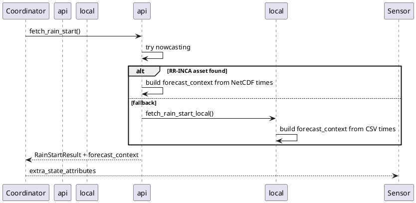

# Pipeline & Forecast-Window Sensor Attribute

**Status:** Draft plan  
**Date:** 2026-06-20  
**Target version:** **0.1.3** (recommended)

## Problem

v0.1.2 exposes `data_source`, `forecast_horizon_minutes`, and `forecast_point`, but automations and dashboards cannot tell at a glance:

| Question | Today |
|----------|-------|
| Which pipeline ran? | Partially — `data_source` is opaque (`nowcasting` vs `local_forecasting`) |
| Which parameter / timestep? | Not exposed |
| What time window does the estimate cover? | Only total minutes — no start/end |
| Can I trust 1–10 min automations? | User must know local fallback is hourly |

Example: `data_source: local_forecasting` + `forecast_horizon_minutes: 360` does not communicate **60 min steps** or **window end at 18:00**.

## Goal

Add **one new sensor attribute** that makes pipeline identity and forecast window visible without reading logs or diagnostics.

## Version recommendation: 0.1.3, not 0.2.1

| Option | Verdict |
|--------|---------|
| **0.1.3** | **Recommended.** Additive, backward-compatible sensor attribute. Same v0.1 scope (sensor-only, no config changes). |
| 0.2.0 | Overkill for one attribute; reserve for a bundled minor (e.g. binary sensor, weather entity, automation blueprint). |
| 0.2.1 | **Avoid.** Implies a patch on a minor that was never released; breaks the version line after 0.1.2. |

Pre-1.0 semver is flexible, but **stay on 0.1.x until a user-visible feature set warrants 0.2.0**.

## Cheap model: single dict attribute `forecast_context`

One attribute, fixed schema, built once per poll in `RainStartResult`:

```python
forecast_context: dict[str, str | int]
```

### Schema (v1)

| Key | Type | Example (local fallback) | Example (nowcasting grid) |
|-----|------|--------------------------|----------------------------|
| `pipeline` | str | `local_forecasting` | `nowcasting` |
| `collection` | str | `ch.meteoschweiz.ogd-local-forecasting` | `ch.meteoschweiz.ogd-nowcasting` |
| `parameter` | str | `rre150h0` | `RR-INCA` |
| `step_minutes` | int | `60` | `10` |
| `window_start` | str (ISO, Europe/Zurich) | `2026-06-20T12:00:00+02:00` | `2026-06-20T12:00:00+02:00` |
| `window_end` | str (ISO, Europe/Zurich) | `2026-06-20T18:00:00+02:00` | `2026-06-20T18:00:00+02:00` |

Optional when relevant:

| Key | Type | When |
|-----|------|------|
| `forecast_point` | str | Local pipeline only (move from top-level attribute — see migration) |
| `intensity_unit` | str | `mm/h` (nowcasting) or `mm/h` per hour bucket (local) |

### Display string (derived, not stored)

For UI / notifications, derive a one-liner in automations:

```jinja
{{ state_attr('sensor.meteoswiss_rainstart_next_rain_minutes', 'forecast_context').pipeline }}
· {{ state_attr(..., 'forecast_context').step_minutes }} min
· until {{ state_attr(..., 'forecast_context').window_end }}
```

No extra attribute needed — keeps the model cheap.

## Data flow



### Window bounds (single source of truth)

Compute from the **same time series** used for rain scan (DRY):

```python
window_start = first_timestep.astimezone(ZURICH).isoformat()
window_end   = last_timestep.astimezone(ZURICH).isoformat()
step_minutes = _timestep_minutes(times)  # already exists in api.py
horizon      = step_minutes * (len(times) - 1)  # keep forecast_horizon_minutes consistent
```

Do **not** store horizon separately in `forecast_context` — avoid duplication; keep existing `forecast_horizon_minutes` attribute for automations that already use it.

### Pipeline constants (DRY)

Add to `const.py`:

```python
PIPELINE_NOWCASTING = {
    "pipeline": "nowcasting",
    "collection": STAC_COLLECTION_NOWCASTING,
    "parameter": "RR-INCA",
    "step_minutes": 10,
}
PIPELINE_LOCAL = {
    "pipeline": "local_forecasting",
    "collection": STAC_COLLECTION_LOCAL,
    "parameter": LOCAL_FORECAST_PRECIP_PARAM,
    "step_minutes": 60,
}
```

Helper:

```python
def build_forecast_context(
    pipeline: dict[str, str | int],
    *,
    times: np.ndarray,
    forecast_point: str | None = None,
) -> dict[str, str | int]:
    ...
```

## Sensor surface (after 0.1.3)

| Attribute | Change |
|-----------|--------|
| `forecast_context` | **New** — pipeline + window |
| `data_source` | Keep (duplicate of `forecast_context.pipeline`) for backward compatibility |
| `forecast_horizon_minutes` | Keep |
| `forecast_point` | Keep at top level (or deprecate later in 0.2.0) |

## Implementation steps

| Step | File | Effort |
|------|------|--------|
| 1 | `const.py` — pipeline presets | S |
| 2 | `api.py` — `build_forecast_context()`, extend `RainStartResult` | S |
| 3 | `api.py` / `local_forecast.py` — set window from parsed `times` | S |
| 4 | `sensor.py` — expose `forecast_context` | S |
| 5 | `diagnostics.py` — include `forecast_context` | S |
| 6 | `tests/test_api.py`, `tests/test_local_forecast.py` — assert schema | S |
| 7 | `manifest.json` → `0.1.3`; docs/changelog | S |

**Estimated diff:** ~80–120 lines. No new dependencies. No config flow changes.

## TDD checklist

```python
def test_build_forecast_context_nowcasting():
    # fixture NetCDF times → step_minutes=10, window_start/end in Zurich

def test_build_forecast_context_local():
    # mocked hourly series → step_minutes=60

def test_horizon_matches_window():
    # forecast_horizon_minutes == step * (n-1)
```

## Non-goals (0.1.3)

- Removing `data_source` / `forecast_point` (breaking)
- New entity or binary sensor
- Localization of `forecast_context` strings
- STAC asset URL in attributes (diagnostics only)
- Interpolation or multi-pipeline merge

## Future (0.2.0 candidates)

- Binary sensor `rain_imminent` derived from same `RainStartResult`
- Drop redundant top-level `data_source` with deprecation period
- `forecast_context.version: 2` if schema grows

## Acceptance criteria

- [ ] Developer Tools shows `forecast_context` on every successful poll
- [ ] Local fallback: `step_minutes: 60`, window spans parsed CSV range
- [ ] When nowcasting assets appear: `step_minutes: 10`, `parameter: RR-INCA` without config change
- [ ] Unit tests pass in venv
- [ ] Docs/changelog updated for v0.1.3

## Related

- [Concept v0.1.2](../what/meteoswiss_rainstart_concept.md)
- [Implementation plan v0.1.2](2026-06-20-1400-meteoswiss-rainstart-plan.md)
- [Changelog](../changelog.md)

## Changelog

| Date | Change |
|------|--------|
| 2026-06-20 | Initial plan; recommend v0.1.3 |
