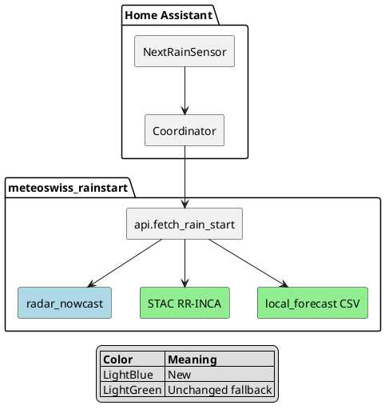
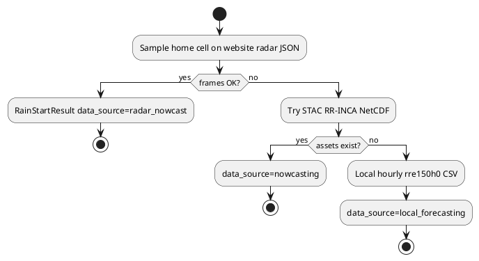

# Website radar nowcast as rain-start source

**Status:** Implemented (v0.2.0)  
**Date:** 2026-08-29

## Overview

The existing sensor still used hourly STAC local forecasting because official RR-INCA NetCDF assets are unpublished. The working 5-minute rain ETA is the MeteoSwiss precipitation website JSON (RZC + INCA rate). v0.2.0 ports that sampler into `meteoswiss_rainstart` as the **primary** pipeline. Same entity, same state machine.

## Architecture



## Runtime order



## Design decisions

| Decision | Rationale |
|----------|-----------|
| Same sensor, not a second entity | Existing automations and `sensor.meteoswiss_rainstart_belp_next_rain_minutes` keep working |
| Website JSON first | Live 5 min / 1 km cell; STAC grid still unpublished |
| Decode logic from a prior local radar sampler | Already tested against the painted map |
| Do not call RZC time "now" | Scan + publish lag; expose `radar_time` / `source_updated` |
| Ignore stale wet measurement when latest is dry | Same ETA rule as `ping` |
| Unofficial feed | Personal poller only; schema drift is a known risk |

## Sensor mapping

| Situation | State |
|-----------|-------|
| Latest measurement wet at or above threshold | `0` |
| Latest dry, first forecast wet | minutes from wall clock to that frame |
| No wet frame in window | `unknown` |
| Fetch/parse error after all pipelines fail | `unavailable` |

Attributes added when radar wins: `data_source=radar_nowcast`, `radar_time` (HH:MM of last RZC frame), `forecast_context.pipeline=radar_nowcast`, `step_minutes=5`.

## Implementation steps

1. Port decode / sample / picture window / first-wet into `radar_nowcast.py`.
2. Map ping report to `RainStartResult`.
3. Call radar first from `fetch_rain_start`.
4. Keep STAC then local as fallbacks.
5. Offline unit tests (no network).
6. Bump `0.2.0`.

## Files changed

| File | Change |
|------|--------|
| `custom_components/meteoswiss_rainstart/radar_nowcast.py` | New |
| `custom_components/meteoswiss_rainstart/api.py` | Radar first |
| `custom_components/meteoswiss_rainstart/const.py` | `DATA_SOURCE_RADAR`, `PIPELINE_RADAR` |
| `custom_components/meteoswiss_rainstart/sensor.py` | `radar_time` attribute |
| `custom_components/meteoswiss_rainstart/coordinator.py` | Upgrade notify includes radar |
| `tests/test_radar_nowcast.py` | New |
| `manifest.json` | `0.2.0` |

## Testing

```bash
.venv/bin/pytest tests/ -m 'not integration'
```

Live check after deploy: entity `data_source` should be `radar_nowcast`, not `local_forecasting`.

## Risks

| Risk | Mitigation |
|------|------------|
| Unofficial JSON schema change | Decode tests on synthetic blob; fallbacks remain |
| Website rate limits | Default poll 300 s; reuse httpx client when given |
| Threshold 0.1 vs website 0.2 bin | Sensor still uses config threshold; legend lower bound is 0.2 mm/h |

## Known limitations

- No rain-end sensor in this change.
- Visual raster cross-check stays in the Minis script, not in HA.
- HACS still unpublished.

## Related Documents

- [Concept](../what/meteoswiss_rainstart_concept.md)
- [Changelog](../changelog.md)
- Sampler SoT: local radar nowcast script used during development

## Changelog

| Date | Change |
|------|--------|
| 2026-08-30 | Removed private sampler path |
| 2026-08-29 | Initial version for v0.2.0 |

## Prompt History

- User asked when rain ends, then for the HA MeteoSwiss next-rain work.
- User asked to read the HACS repo; rain-start lives at `csenf/ha-meteoswiss-rainstart`.
- User: put the MeteoSwiss nowcast rain sensor into that repo.
