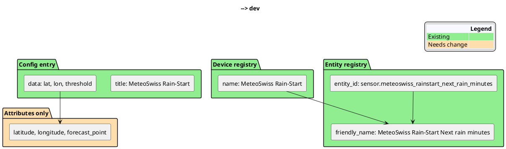
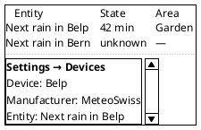
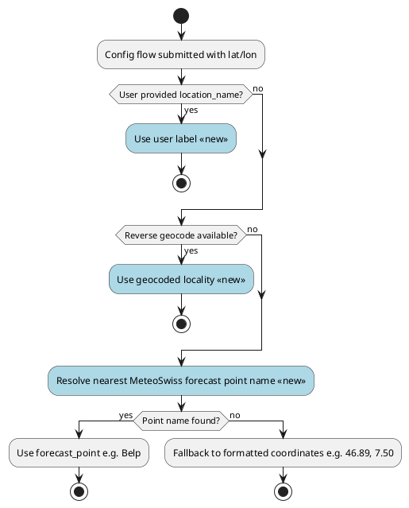
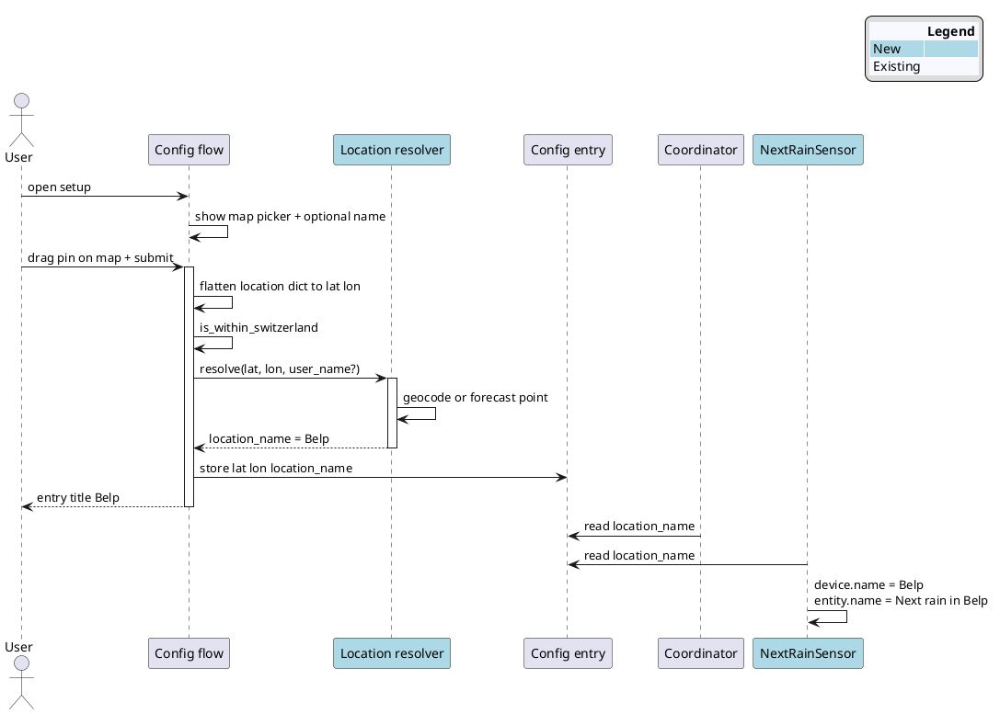
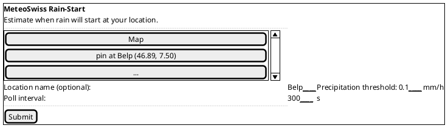
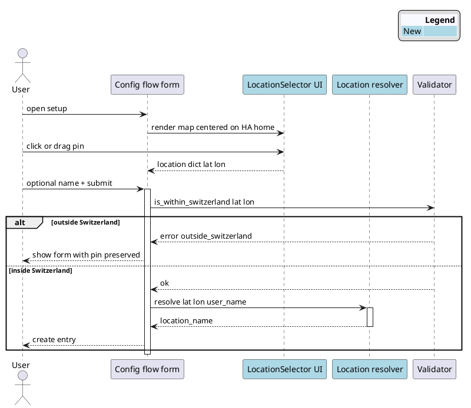

# Entity Location Naming — Concept

**Status:** Draft  
**Date:** 2026-06-20  
**Target release:** v0.1.4 (or bundled with multi-location work)

## Overview

Users want to see **where** a rain-start sensor applies at a glance — e.g. **Next rain in Belp**, not a generic **MeteoSwiss Rain-Start Next rain minutes**. Today the integration stores coordinates in attributes but exposes no human-readable place label in the entity or device name.

This concept covers two coupled UX improvements:

1. **Integrated map picker** — replace manual latitude/longitude number fields with Home Assistant's built-in Location selector.
2. **Location-aware naming** — resolve and persist a human-readable `location_name` used in device name, entity name, and config entry title.

Both ship together in v0.1.4 and enable multi-location setups without ambiguity.

## Current state



| Element | Current value | Problem |
|---------|---------------|---------|
| Config entry title | `MeteoSwiss Rain-Start` | Identical for every location |
| Device name | `MeteoSwiss Rain-Start` | No place disambiguation |
| Entity name | `Next rain minutes` (translated) | Generic |
| Entity ID | Fixed `sensor.meteoswiss_rainstart_next_rain_minutes` | Breaks with a second config entry |
| Location data | `latitude`, `longitude`, optional `forecast_point` attr | Not visible in lists/cards without templates |

Relevant code today:

```31:49:custom_components/meteoswiss_rainstart/sensor.py
    _attr_has_entity_name = True
    _attr_name = "Next rain minutes"
    ...
        self._attr_device_info = {
            "identifiers": {(DOMAIN, entry.entry_id)},
            "name": "MeteoSwiss Rain-Start",
            "manufacturer": "MeteoSwiss",
        }
```

## Goal

| Requirement | Example |
|-------------|---------|
| Pick location on a map during setup | Drag pin to Belp on integrated HA map |
| Readable at a glance in entity picker, dashboard, notification | **Next rain in Belp** · 42 min |
| Stable across reboots | Label does not change when data source switches |
| Works for single and multiple config entries | Home + garden shed |
| Localized | EN: *Next rain in Belp* · DE: *Nächster Regen in Belp* |
| No duplicate geocoding on every poll | Resolve once at setup, cache in config entry |
| Reconfigure location later | Options flow shows same map picker |

## Home Assistant naming model

With `_attr_has_entity_name = True`, the UI **friendly name** is:

```text
{device.name} {entity.name}
```

So location can appear in **device name**, **entity name**, or **both**. The user preference (*Next rain in Belp*) maps best to a **location-aware entity name** plus a **short device name** used for grouping.



## Location label sources



| Source | Pros | Cons | When to use |
|--------|------|------|-------------|
| **User-entered `location_name`** | Matches mental model; works offline; user can say "Garden" | Extra config field | Primary — optional in config flow, editable in options |
| **Reverse geocoding** (Nominatim / HA helpers) | Automatic from map pin | Rate limits; may return "Belp BE" vs "Belp"; needs network at setup | Default suggestion in config flow |
| **MeteoSwiss `forecast_point`** | Already in pipeline; official grid point; no extra API | Only after catalog load; may differ from village name user expects | Fallback when geocoding fails |
| **Coordinates string** | Always available | Not friendly | Last-resort fallback |

**Recommendation:** Hybrid resolution at **config-entry creation**, persisted as `location_name` in entry data. Re-resolve only when user edits location in options flow.

The nearest forecast point catalog (`ogd-local-forecasting_meta_point.csv`) is already loaded in `local_forecast.py` — reuse `nearest_forecast_point(lat, lon).name` during setup without waiting for the first rain fetch.

## Design decisions

| Decision | Choice | Rationale |
|----------|--------|-----------|
| Coordinate input | HA `LocationSelector` (map picker) | Native UI, no custom frontend; click or drag pin |
| Coordinate storage | Flat `latitude` / `longitude` in entry data | Coordinator unchanged; flatten selector dict on submit |
| Where to store label | `ConfigEntry.data["location_name"]` | Stable, user-editable, survives coordinator restarts |
| Display pattern | Entity name: `{translation} in {location}` | Matches user ask (*Next rain in Belp*) |
| Device name | `location_name` only (e.g. `Belp`) | Short grouping in device registry; manufacturer stays MeteoSwiss |
| Config entry title | Same as `location_name` | Clear in Settings → Integrations list |
| Entity ID | `sensor.{domain}_{slug}_next_rain_minutes` | Unique per location; slug from normalized location_name |
| Translation | `entity.sensor.next_rain_minutes.name` with `{location_name}` placeholder | Proper EN/DE grammar for "in" / "in" |
| Dynamic rename | Avoid changing name after first fetch | Prevents entity_id / automation breakage |
| CH bounds enforcement | Server-side `is_within_switzerland()` after submit | Map has no bbox overlay; error on invalid pin |
| Radius | Disabled (`radius=False`) | Point forecast only; no area-based rain-start |

## Target architecture



## Naming examples

| `location_name` | Device name | Entity name (EN) | Friendly name (UI) | Entity ID slug |
|-----------------|-------------|------------------|--------------------|----------------|
| Belp | Belp | Next rain in Belp | Belp Next rain in Belp* | `belp` |
| Garden | Garden | Next rain in Garden | Garden Next rain in Garden | `garden` |
| (fallback) 46.89, 7.50 | 46.89, 7.50 | Next rain in 46.89, 7.50 | … | `46_89_7_50` |

\*HA concatenates device + entity. If the duplicated location feels redundant, two alternatives:

| Variant | Device name | Entity name | Friendly name |
|---------|-------------|-------------|---------------|
| **A — recommended** | Belp | Next rain in Belp | Belp Next rain in Belp |
| **B — compact** | MeteoSwiss Rain-Start | Next rain in Belp | MeteoSwiss Rain-Start Next rain in Belp |
| **C — location-only device** | Belp | Next rain minutes | Belp Next rain minutes |

**Preferred default: Variant A.** Location appears twice in full friendly name but reads naturally in entity-only contexts (automations, `{{ state_attr(...) }}` templates, mobile app entity list when device is collapsed). Variant C loses the "in Belp" phrasing.

For notifications, document a template:

```jinja2
Rain in {{ state_attr('sensor.meteoswiss_rainstart_belp_next_rain_minutes', 'location_name') }}
in {{ states('sensor.meteoswiss_rainstart_belp_next_rain_minutes') }} minutes.
```

## Config flow — integrated map picker

Home Assistant ships a native **Location selector** for config flows. No custom frontend, Lovelace card, or third-party widget is required. The selector renders an interactive map; the user clicks or drags a pin and the flow receives `{latitude, longitude}`.

### Before vs after

| | Current (v0.1.x) | Target (v0.1.4) |
|--|------------------|-----------------|
| Coordinate input | Two number fields (`latitude`, `longitude`) | Single map picker field (`location`) |
| Default position | HA home lat/lon as field defaults | HA home lat/lon as map pin default |
| UX | User looks up coordinates externally | User picks point visually on map |
| Validation | Same `outside_switzerland` error | Same — runs after map submit |
| Entry data shape | `{latitude, longitude, ...}` | Unchanged — flatten selector dict on submit |

### Setup form wireframe



The optional **Location name** field pre-fills from the resolver after the first successful pin placement (or on submit). User can override before confirming — e.g. rename geocoded "Belp BE" to "Garden".

### Schema change

Replace separate lat/lon fields in `config_flow.py`:

```python
from homeassistant.helpers import selector

CONF_LOCATION = "location"

STEP_USER_SCHEMA = vol.Schema(
    {
        vol.Required(CONF_LOCATION): selector.LocationSelector(
            selector.LocationSelectorConfig(
                radius=False,
                icon="mdi:weather-pouring",
            )
        ),
        vol.Optional(CONF_LOCATION_NAME): str,
        vol.Optional(CONF_THRESHOLD, default=DEFAULT_THRESHOLD_MM): vol.Coerce(float),
        vol.Optional(CONF_POLL_INTERVAL, default=DEFAULT_POLL_INTERVAL): vol.All(
            vol.Coerce(int), vol.Range(min=60, max=3600)
        ),
    }
)
```

Default pin — same behaviour as today, via suggested values:

```python
def _default_schema(self) -> vol.Schema:
    return self.add_suggested_values_to_schema(
        STEP_USER_SCHEMA,
        {
            CONF_LOCATION: {
                CONF_LATITUDE: self.hass.config.latitude,
                CONF_LONGITUDE: self.hass.config.longitude,
            },
            CONF_THRESHOLD: DEFAULT_THRESHOLD_MM,
            CONF_POLL_INTERVAL: DEFAULT_POLL_INTERVAL,
        },
    )
```

Submit handler — flatten selector output, then validate and resolve name:

```python
location = user_input[CONF_LOCATION]
latitude = location[CONF_LATITUDE]
longitude = location[CONF_LONGITUDE]

if not is_within_switzerland(latitude, longitude):
    errors["base"] = "outside_switzerland"

location_name = await resolve_location_name(
    self.hass,
    latitude,
    longitude,
    user_input.get(CONF_LOCATION_NAME),
)

return self.async_create_entry(
    title=location_name,
    data={
        CONF_LATITUDE: latitude,
        CONF_LONGITUDE: longitude,
        CONF_LOCATION_NAME: location_name,
        CONF_THRESHOLD: user_input[CONF_THRESHOLD],
        CONF_POLL_INTERVAL: user_input[CONF_POLL_INTERVAL],
    },
)
```

### Translation keys

Update `translations/en.json` and `de.json` — remove lat/lon labels, add map and optional name:

```json
"data": {
  "location": "Location",
  "location_name": "Location name (optional)",
  "threshold_mm": "Precipitation threshold (mm/h)",
  "poll_interval": "Poll interval (seconds)"
}
```

German:

```json
"location": "Standort",
"location_name": "Ortsname (optional)"
```

### Options and reconfigure flows

Use the same `LocationSelector` when the user edits an existing entry:

| Flow | Trigger | Behaviour |
|------|---------|-----------|
| Options flow | Settings → Integration → Configure | Map pre-centred on stored lat/lon; re-validates CH bounds |
| Reconfigure | HA reconfigure action (if enabled) | Same schema; updates coordinates and optionally re-resolves name |

When coordinates change but the user keeps a custom `location_name`, do not overwrite the label unless the name field is empty.

### Map picker constraints

| Aspect | Detail |
|--------|--------|
| HA API | `homeassistant.helpers.selector.LocationSelector` — stable since ~2022 |
| Radius | Not used (`radius=False`) — rain-start is a point forecast |
| Storage | Selector returns nested dict; entry data stays flat for coordinator compatibility |
| Map bounds | Global map — no Switzerland clip or overlay |
| CH validation | Server-side only via existing `is_within_switzerland()` |
| Offline setup | Map renders; geocode fallback may fail — forecast point or manual name still work |
| Reference | Core `geo_json_events` config flow uses identical pattern |



## Implementation steps

1. **Constants** — add `CONF_LOCATION = "location"` and `CONF_LOCATION_NAME = "location_name"`.
2. **`location.py`** (new) — `async def resolve_location_name(hass, lat, lon, user_name: str | None) -> str` with priority chain from activity diagram; slugify helper for entity IDs.
3. **Config flow** — replace lat/lon number fields with `LocationSelector`; add optional `location_name` text field; flatten selector dict on submit; call resolver; set entry title to resolved name; keep flat `latitude`/`longitude` in entry data.
4. **Options flow** (new or extend) — same map picker + optional name; re-validate CH bounds on coordinate change; update entry data and entity registry names.
5. **Sensor** — read `location_name` from entry; set `device_info["name"]`; translation with `{location_name}` placeholder; generate `entity_id` from slug (remove hardcoded ID in `async_setup_entry`).
6. **Translations** — EN/DE config step labels (`location`, `location_name`) and entity name placeholder:

   ```json
   "entity": {
     "sensor": {
       "next_rain_minutes": {
         "name": "Next rain in {location_name}"
       }
     }
   }
   ```

   Use `translation_placeholders={"location_name": self._location_name}` on the entity.

7. **Attributes** — add `location_name` to `extra_state_attributes` for templates (even though it is also in the name).
8. **Migration** — config entry v2: existing entries get `location_name` from resolver on upgrade; preserve old entity_id via `entity_registry.async_get` or one-time rename map. Coordinate fields unchanged — no map picker migration needed for stored data.
9. **Diagnostics** — include `location_name` in snapshot.

### Verification checkpoints

- [ ] Setup form shows integrated map picker instead of lat/lon number fields
- [ ] Map pin defaults to HA home location
- [ ] Pin outside Switzerland shows `outside_switzerland` error with pin preserved
- [ ] Single entry shows *Next rain in Belp* (or geocoded equivalent) in entity picker
- [ ] Second entry at different coordinates gets distinct entity_id and name
- [ ] Options flow allows moving pin and updating name
- [ ] Rename in options updates device + entity names without breaking automations (entity_id unchanged after first assign)
- [ ] DE locale renders map labels and *Nächster Regen in Belp*
- [ ] Entry without geocoding still gets forecast_point or coordinate fallback

## Files changed

| File | Change |
|------|--------|
| `const.py` | `CONF_LOCATION`, `CONF_LOCATION_NAME` |
| `location.py` | New resolver + slugify |
| `config_flow.py` | `LocationSelector` map picker; optional name; resolver; entry title; options flow |
| `sensor.py` | Dynamic device/entity naming, slug-based entity_id |
| `coordinator.py` | Optional: expose resolved point name early |
| `translations/en.json`, `de.json` | Map picker labels, optional name, entity name placeholder |
| `tests/test_location.py` | Resolver priority, slugify, fallbacks |
| `tests/test_config_flow.py` | Map picker submit, CH validation, flatten selector dict |

## Testing strategy

| Test | Type |
|------|------|
| Config flow accepts LocationSelector dict and stores flat lat/lon | Unit |
| Config flow rejects pin outside Switzerland | Unit |
| Options flow updates coordinates via map picker | Integration (hass) |
| Resolver prefers user name over geocode | Unit |
| Resolver falls back to forecast point when geocode fails | Unit |
| Slugify handles umlauts (Büren → `bueren`) | Unit |
| Config flow stores `location_name` and sets title | Integration (hass) |
| Two entries → two distinct entity_ids | Integration |
| Migration v1 → v2 populates `location_name` | Integration |

## Risks and mitigations

| Risk | Impact | Mitigation |
|------|--------|------------|
| Entity ID change on upgrade breaks automations | High | Migration keeps existing entity_id; only new entries use slug |
| Geocoding unavailable in HA Core container | Medium | Forecast-point fallback always available |
| User places pin outside Switzerland | Low | Existing error message; pin position preserved on re-show |
| User label ≠ MeteoSwiss point name | Low | Document that label is display-only; attrs keep `forecast_point` |
| Duplicate "Belp … in Belp" in friendly name | Low | Accept for Variant A or offer Variant C in options later |
| Hardcoded entity_id in user automations/docs | Medium | Document new pattern; migration alias period |
| Map picker unavailable on very old HA | Low | Document minimum HA version; integration already targets current Core |

## Known limitations

- Map shows the world — no Switzerland bounding-box overlay; invalid pins caught by server validation only.
- Nowcasting grid has no named point — display label comes from config/geocode, not grid cell ID.
- Reverse geocoding quality depends on HA/Nominatim; offline setup needs manual name or forecast point.
- Area assignment (e.g. "Garden" area in HA) remains separate — user assigns device to area manually or via automation.

## Out of scope (this concept)

- Automatic HA Area creation from coordinates
- Custom Switzerland bounding-box overlay on the map
- Weather entity or binary `rain_imminent` naming (same pattern applies when added)

## Related Documents

- [MeteoSwiss Rain-Start concept](meteoswiss_rainstart_concept.md) — parent requirements
- [Implementation plan v0.1.2](../how/2026-06-20-1400-meteoswiss-rainstart-plan.md) — baseline architecture
- [Pipeline/window attribute plan](../how/2026-06-20-pipeline-window-attribute-plan.md) — related sensor attribute work
- [Entity location naming plan (v0.1.4)](../how/2026-06-20-1427-entity-location-naming-plan.md) — implementation plan

## Changelog

| Date | Change |
|------|--------|
| 2026-06-20 | Initial concept |
| 2026-06-20 | Added config-flow Location selector (map picker) section |
| 2026-06-20 | Integrated map picker as first-class design: wireframe, schema, translations, options flow, tests |

## Prompt History

- User requested a concept for showing entity location in the name (e.g. *Next Rain in Belp*), referencing the current `sensor.py` implementation.
- User asked whether coordinates input can use an integrated map picker in the config flow.
- User confirmed map picker should be added to the concept document as a planned v0.1.4 feature.
