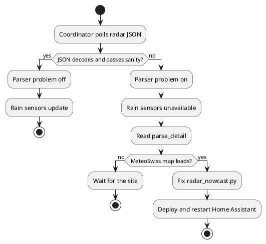

# MeteoSwiss Rain-Start Home Assistant Plugin

**Status:** Implemented (v0.2.0)  
**Domain:** `meteoswiss_rainstart`

## Objective

Home Assistant custom integration that estimates when rain will start at a pin in Switzerland. Primary use: notify when rain is near and windows are open.

## What was established

The working 5-minute rain ETA is the MeteoSwiss precipitation website JSON (RZC + INCA rate) sampled at the home cell. Official STAC RR-INCA and hourly local forecasting are not used.

The user must type a location name at setup. That name labels the device.

Use domain `meteoswiss_rainstart` — do not reuse `meteoswiss` (Rudd-O's forecast integration already occupies that domain in this Home Assistant instance).

## Decisions made

| Decision | Rationale |
|----------|-----------|
| `DataUpdateCoordinator` | HA standard for periodic polling and shared error handling |
| `_async_setup` on coordinator | One-time CH bounds validation before first poll |
| Blocking I/O in executor | Radar HTTP must not block the event loop |
| `api.py` + `radar_nowcast.py` | Bounds/LV95 in api; website JSON sample in radar_nowcast |
| rsync deploy | Dev machine cannot symlink into Docker-mounted HA config |

## Current (after v0.2.0)

- Rain-start source: website radar nowcast only. STAC RR-INCA and hourly local forecasting are removed.
- Setup requires a user-entered location name. No catalog auto-name.
- Rates are legend lower bounds, not true millimetres per hour.
- After a code deploy, restart Home Assistant. Reload does not reimport modules.

### Entities

| Entity | Role |
|--------|------|
| Next rain minutes | Minutes until the home cell is wet. `0` if wet now. `unknown` if none in the horizon. |
| Raining | On when the home cell meets the threshold. |
| Precipitation | Current cell rate (legend lower bound). |
| Nearest rain | Kilometres to the nearest wet blob. `0` when wet. |
| Rain end | Minutes until the current or next wet stretch goes dry. |
| Intensity graph | Measured (blue) and forecast (cyan) bars. |
| Data age | Minutes since the latest radar frame. |
| Next fetch | Time of the next poll. |
| Parser problem | Off while the unofficial JSON decodes. On when it does not. |

### When Parser problem is on

The binary uses Home Assistant's problem class. **On** means broken (`parse_ok` is false).

1. Ignore the rain sensors. They are `unavailable`.
2. Read `parse_detail` on Parser problem and the persistent notification.
3. Open the MeteoSwiss precipitation map. If the map is down, wait.
4. If the map works, the unofficial JSON or legend changed. Check the log for `RadarParseError`.
5. Fix `radar_nowcast.py`, deploy, and restart Home Assistant. Reload is not enough.
6. After a good poll the flag turns off. Dismiss the notification.

A network error does not turn this flag on.

## Implemented in v0.2.0

- Website radar nowcast (`radar_nowcast.py`) is the **primary** rain-start pipeline: RZC measurement + INCA rate JSON at the configured 1 km cell, 5-minute steps
- Same sensor and state machine; `data_source: radar_nowcast` when that feed works
- Fallback order at release: radar → STAC RR-INCA NetCDF → hourly local CSV (later dropped; radar only)
- Sensor attribute `radar_time` (last RZC frame; do not call it "now")
- Plan: [how/2026-08-29-1330-radar-nowcast-plan.md](../how/2026-08-29-1330-radar-nowcast-plan.md)

## Implemented in v0.1.4

- Map picker in setup/options flow using Home Assistant `LocationSelector`
- `location_name` resolved and persisted (`user input` → nearest MeteoSwiss forecast point name → coordinate fallback)
- Location-aware entity naming and device name (`Next rain in {location_name}`)
- `sensor.meteoswiss_rainstart_{slug}_next_rain_minutes` entity_id for new installs (v1 entries keep legacy id via migration flag)
- `location_name` in sensor attributes + diagnostics
- Options flow to change location / name
- Config entry migration v1→v2
- New modules: `location.py`; updated config/sensor/coordinator/translations
- Unit tests for location helpers and schema builder

## Implemented in v0.1.2

### Home Assistant integration

- Config flow (en/de) with lat, lon, threshold, poll interval
- Sensor `sensor.meteoswiss_rainstart_next_rain_minutes` (`min`)
- States: `unavailable` on errors, `unknown` when no rain in horizon, `0` when raining now, positive integer otherwise
- Attributes: `rain_start`, `intensity`, `source_updated`, `forecast_horizon_minutes`, `threshold_mm`, `latitude`, `longitude`, `data_source`
- Integration diagnostics (fetch status, data source, configured location)
- Deploy script `scripts/deploy.sh`

### Data pipeline

1. **Website radar nowcast** (unofficial precipitation animation JSON: RZC + INCA rate, ~1 km, 5 min)

If the radar feed fails, the sensor is `unavailable`.

### Python stack (`manifest.json`)

- `httpx` — radar JSON downloads
- `pyproj` — WGS84 → Swiss LV95 for the home cell

### Tests

- `tests/test_api.py` — CH bounds, LV95, radar-only fetch
- `tests/test_radar_nowcast.py` — website JSON decode, ETA mapping
- `tests/test_location.py` — required location name, slugify
- Run in venv: `.venv/bin/pytest tests/ -m 'not integration'`

## Sensor state machine

| Situation | State |
|-----------|-------|
| Fetch/setup error | `unavailable` |
| No rain in forecast horizon | `unknown` |
| Raining at t=0 | `0` |
| Rain expected later | minutes until start (`int`) |

Timestamps use timezone-aware `Europe/Zurich`.

## Still open / follow-up

| Item | Status |
|------|--------|
| Disable legacy automation `Notify when rain is about to start` (id `1778493348393`) | Manual — uses broken `precipitation_probability` template |
| Add nowcast automation on `sensor.meteoswiss_rainstart_next_rain_minutes` | Manual — see plan |
| `forecast_context` sensor attribute (pipeline + window) | Done v0.1.3 |
| Entity location naming + map picker | Done v0.1.4 — [plan](../how/2026-06-20-1427-entity-location-naming-plan.md) |
| HACS publication | Scaffolded (`hacs.json`), not published |
| Weather entity, binary `rain_imminent`, multi-location | Future — raining / rain end / intensity graph added |

## Related documents

- [Radar nowcast plan (v0.2.0)](../how/2026-08-29-1330-radar-nowcast-plan.md)
- [Implementation plan (v0.1.2)](../how/2026-06-20-1400-meteoswiss-rainstart-plan.md)
- [Changelog](../changelog.md)
